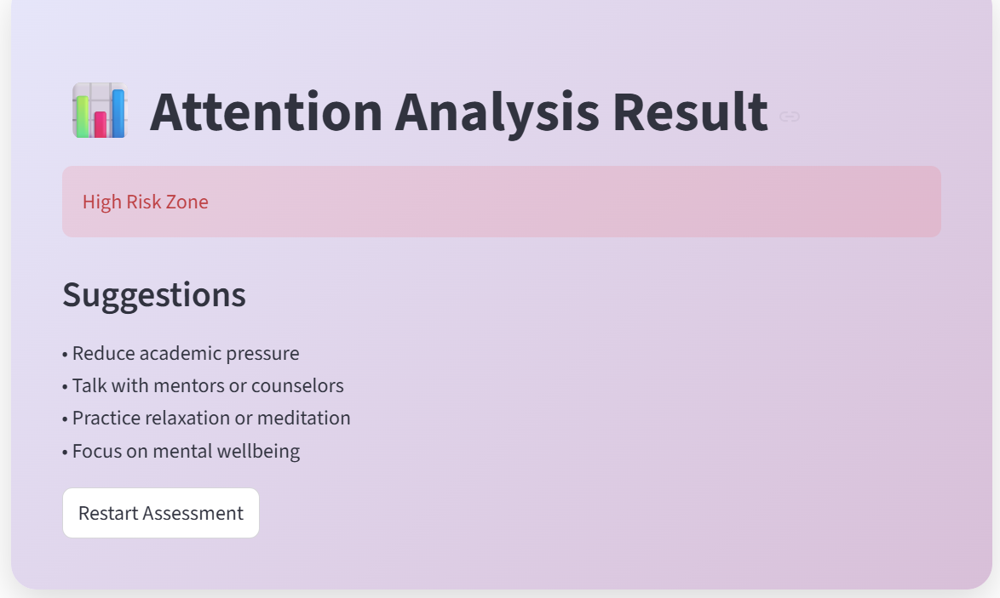

# Academic Attention Analyzer (Machine Learning Project)

This project predicts **student attention loss risk** based on academic stress factors using a **Logistic Regression machine learning model**.

The system analyzes factors such as peer pressure, family expectations, academic competition, and workload to determine whether a student falls into a **Low Risk Zone** or **High Risk Zone** for attention loss.

A **Streamlit web interface** is used to interact with the trained machine learning model and display predictions.

---

## Project Goal

The goal of this project is to demonstrate the use of **data analysis, machine learning, and model deployment** using Python.

This project showcases skills in:

- Data preprocessing
- Machine learning model training
- Model prediction
- Web application deployment

---

## Features

- Interactive questionnaire interface
- Machine learning based prediction
- Binary classification:
  - Low Risk Zone
  - High Risk Zone
- Real-time predictions using a trained ML model
- Clean user interface using Streamlit

---

## Input Factors Used

The model predicts attention loss based on the following academic factors:

1. Peer pressure  
2. Academic pressure from home  
3. Academic competition level  
4. Academic stress index  
5. Academic stage difficulty  

---

## Machine Learning Workflow

1. Data preprocessing using **Pandas**
2. Feature handling using **NumPy**
3. Data visualization using **Matplotlib** and **Seaborn**
4. Model training using **Logistic Regression (Scikit-learn)**
5. Model evaluation
6. Model deployment using **Streamlit**

---

## Technologies Used

### Programming Language
Python

### Data Processing
- Pandas
- NumPy

### Data Visualization
- Matplotlib
- Seaborn

### Machine Learning
- Scikit-learn
- Logistic Regression

### Deployment
- Streamlit

---

## Project Structure

academic-attention-analyzer

app.py — Streamlit application  
attention_loss_model_training.ipynb — Machine learning notebook  
model.pkl — Trained ML model  
requirements.txt — Project dependencies  
demo.png — Application screenshot  
README.md — Project documentation  
.gitignore  
LICENSE  

---

## Installation

Clone the repository:

git clone https://github.com/your-username/academic-attention-analyzer.git

Install dependencies:

pip install -r requirements.txt

Run the Streamlit application:

streamlit run app.py

---

## Application Preview

---

## Future Improvements

- Use larger real-world datasets
- Improve model accuracy
- Add visualization dashboards
- Implement additional machine learning models
- Deploy the application online

---

## Author

Harshitha Gadde  
B.Tech CSE (Artificial Intelligence & Machine Learning)

---

## License

This project is licensed under the **MIT License**.
